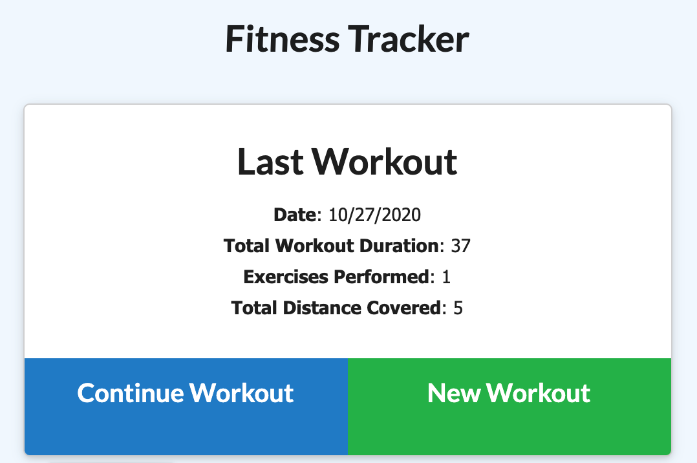
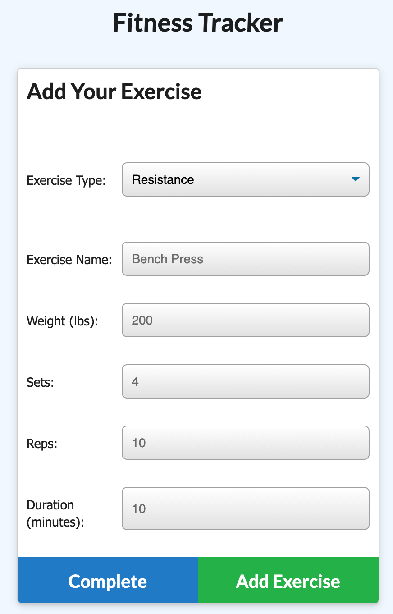
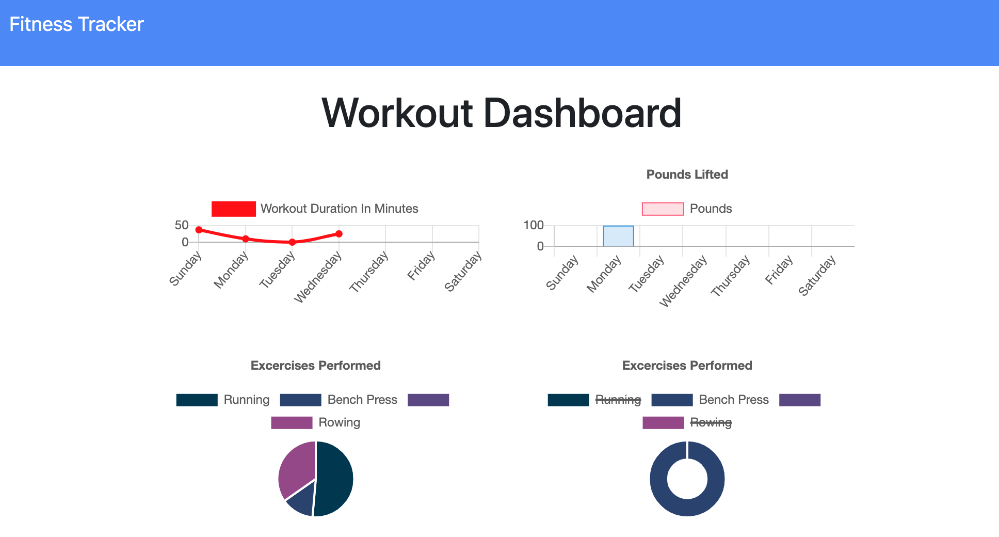

# Workout-Tracker
[](https://bwaycarl.github.io/Portfolio/)
[](https://github.com/BwayCarl/Workout-Tracker/blob/master/LICENSE)
[](https://github.com/BwayCarl/Workout-Tracker/issues)
[](https://github.com/BwayCarl/Workout-Tracker/network)
[](https://github.com/BwayCarl/Workout-Tracker/stargazers)
## Homework Assignment - Unit 14
#### Rutgers Coding Bootcamp / RUT-JER-FSF-PT-06-2020-U-C

## *Table of Contents*
- [Description](#description)
- [Installation](#installation)
- [Usage](#usage)
- [Contributing](#contributing)
- [Authors](#authors)
- [Screenshots](#screenshots)
- [Contact Me](#contact-me)
- [License](#license)

## *Description* 
A workout tracker using a Mongo database with a Mongoose schema and handling routes with Express.

## *Installation* 
 - After cloning the repo, run ```npm install``` from your terminal to install the necessary dependencies:
 
    - ```mongoose ```

    - ```express ```

    - ```morgan ```

- Run ```npm run seed``` to install the initial seeds from the ```seeders/seed.js``` file.

- Run ```nodemon server.js``` from your terminal and use ```localhost:3500``` in your browser.

To deploy an application with a MongoDB database to Heroku, you'll need to set up a MongoDB Atlas account and connect a database from there to your application.


## *Usage*
You can use this app using this **[Heroku Link.](https://shrouded-bayou-99400.herokuapp.com/)**

## *Authors* 
 Carlos Martinez

 Frontend files provided by Rutgers Bootcamp as a starting point for the assignment.

## *Screenshots* 






## *Contact Me*
 - Github: **[BwayCarl](https://github.com/BwayCarl)**
 - LinkedIn: **[Carlos Martinez](https://www.linkedin.com/in/carlos-martinez-8702b146/)** 
 - Twitter: **[@BwayCarlDev](https://twitter.com/BwayDev)**
 - Email: **[bwaycarl@gmail.com](mailto:bwaycarl@gmail.com)**

## *License* 
This project is [MIT](https://github.com/BwayCarl/Workout-Tracker/blob/main/LICENSE) Licensed.
 
 &copy; 2020, Carlos Martinez
